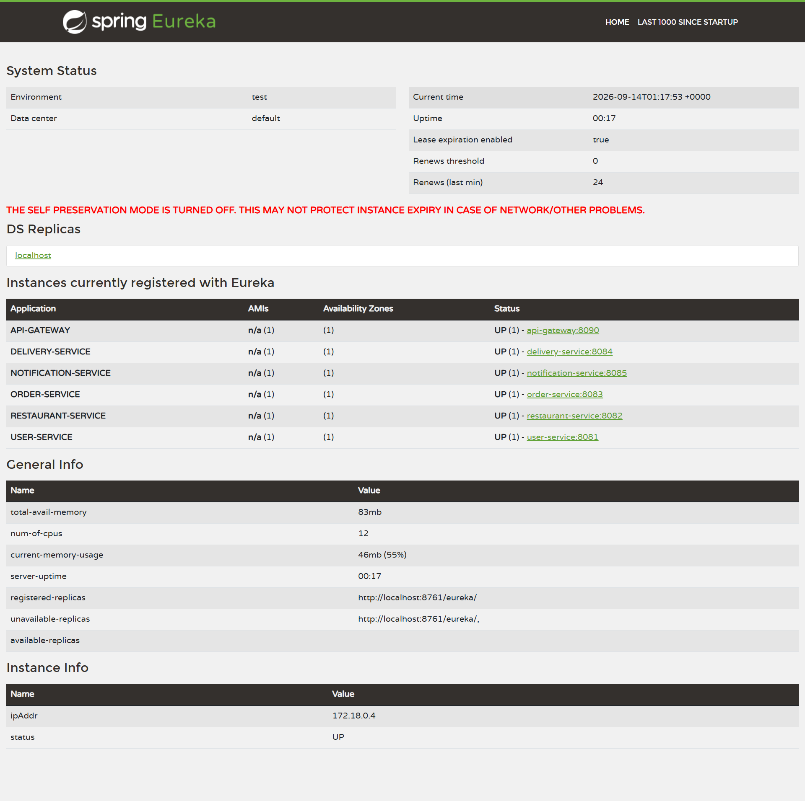
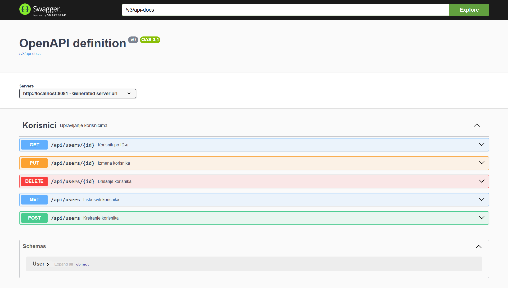

# Dostava hrane — mikroservisni sistem (Spring Cloud)

Distribuirana aplikacija za dostavu hrane izgrađena kao skup Spring Boot mikroservisa.
Sistem pokriva upravljanje korisnicima, restoranima i jelovnicima, kreiranje porudžbina
sa agregacijom podataka iz više servisa, automatsko kreiranje dostava i obaveštenja preko
poruka, kao i upravljanje kuririma. Servisi se pronalaze dinamički kroz Eureka-u, saobraćaj
ulazi kroz jedan API Gateway, a sinhrona komunikacija ide preko OpenFeign-a uz Resilience4j
otpornost na greške.

## 1. Glavne funkcionalnosti

- **Upravljanje korisnicima** — CRUD nad korisnicima, jedinstven email pri kreiranju i izmeni.
- **Restorani i jelovnici** — CRUD nad restoranima i jelima; svako jelo pripada tačno jednom restoranu.
- **Porudžbine** — kreiranje porudžbine sa proverom da jelo pripada izabranom restoranu, obračun ukupne cene sa dostavnom taksom, agregacija podataka o korisniku i restoranu.
- **Dostave i kuriri** — automatsko kreiranje dostave po porudžbini, upravljanje kuririma, dodela kurira dostavi.
- **Obaveštenja** — event-driven servis koji reaguje na kreiranje porudžbine (nema ručnog POST endpointa za kreiranje obaveštenja).

## 2. Arhitektura

Sistem se sastoji od dva infrastrukturna servisa, jednog gateway-a, pet poslovnih servisa i RabbitMQ broker-a.

- **config-server** — centralizovana konfiguracija (native profil, lokalni fajl sistem). Nije Eureka klijent.
- **eureka-server** — service discovery; poslovni servisi i gateway se registruju kao klijenti. Nije registrovan kod samog sebe.
- **api-gateway** — jedinstvena ulazna tačka; rute u YAML-u sa `lb://` prefiksom rutiraju po imenu servisa kroz Eureka-u.
- **user-service** — korisnici.
- **restaurant-service** — restorani i jela.
- **order-service** — porudžbine, Feign pozivi, agregacija, objavljivanje događaja.
- **delivery-service** — dostave i kuriri; potrošač događaja.
- **notification-service** — obaveštenja; potrošač događaja.
- **RabbitMQ** — asinhroni broker za `OrderCreated` događaj.

Postoji **jedna instanca** svakog servisa. Load balancing je realizovan kao rutiranje kroz
Gateway i Eureka-u pomoću `lb://<naziv-servisa>` — Gateway pita Eureka-u gde se servis nalazi
i tamo prosleđuje zahtev;

### Tok zahteva

```
Klijent -> API Gateway (lb://) -> poslovni servis
                                     |
order-service --Feign--> user-service / restaurant-service
order-service --RabbitMQ (OrderCreated)--> delivery-service + notification-service
```

## 3. Tabela servisa

| Servis | Port | Uloga | Osnovna API putanja |
|---|---|---|---|
| config-server | 8888 | Centralizovana konfiguracija | — |
| eureka-server | 8761 | Service discovery | — |
| api-gateway | 8090 | Ulazna tačka, `lb://` rutiranje | `/api/**` |
| user-service | 8081 | Korisnici | `/api/users` |
| restaurant-service | 8082 | Restorani i jelovnici | `/api/restaurants`, `/api/menu-items` |
| order-service | 8083 | Porudžbine i agregacija | `/api/orders` |
| delivery-service | 8084 | Dostave i kuriri | `/api/deliveries`, `/api/couriers` |
| notification-service | 8085 | Obaveštenja (event-driven) | `/api/notifications` |
| RabbitMQ | 5672 (AMQP), 15672 (UI) | Message broker | — |

## 4. Korišćene tehnologije

- **Java 17**, **Maven** (dvofazni Docker build)
- **Spring Boot**, **Spring Web**
- **Spring Cloud**: Netflix Eureka (server + klijenti), Spring Cloud Gateway, OpenFeign, Spring Cloud Config
- **Spring Cloud LoadBalancer** (kroz `lb://` rute)
- **Resilience4j**: Circuit Breaker + Retry
- **Spring AMQP / RabbitMQ**
- **Spring Data JPA**, **H2** (in-memory baza)
- **Bean Validation** (Jakarta Validation)
- **springdoc-openapi** (Swagger UI)
- **Spring Boot Actuator**
- **Docker** / **Docker Compose**

## 5. Obavezne mikroservisne funkcionalnosti

- **Eureka Service Discovery** — `eureka-server` (port 8761); poslovni servisi i gateway registrovani kao klijenti, vidljivi u Eureka UI.
- **API Gateway sa `lb://` rutama** — sve rute u `api-gateway/application.yml` koriste `lb://` i predikate po putanji.
- **OpenFeign** — `order-service` poziva `user-service` i `restaurant-service` preko `@FeignClient(name="...")`, bez hardkodovanih URL-ova.
- **Resilience4j** — `@CircuitBreaker` + `@Retry` sa definisanim fallback metodama u `ExternalDataService`; thresholdovi u `order-service/application.yml`. Napomena: ako neophodni resurs (korisnik, restoran ili jelo) ne postoji na udaljenom servisu, vraća se 404 Not Found; ako servis nije dostupan ili poziv ne uspe iz drugog razloga, vraća se 503 Service Unavailable. U oba slučaja kreiranje porudžbine se prekida.
- **Agregacioni endpoint** — `GET /api/orders/{id}/details` kombinuje porudžbinu sa podacima korisnika i restorana kroz Feign pozive.
- **Swagger / OpenAPI** — Swagger UI dostupan na svakom poslovnom servisu, sa anotacijama na endpoint-ima. (Gateway, Config Server i Eureka Server nemaju Swagger jer nemaju poslovne kontrolere.)
- **Spring Boot Actuator** — `/actuator/health`, `/actuator/info`, `/actuator/metrics` izloženi na svim servisima.
- **CRUD operacije** — pun CRUD u `user`, `restaurant`, `order` i `delivery` servisu; `notification` servis je event-driven (čitanje obaveštenja + označavanje pročitanog).
- **Bean Validation** — validacija ulaza (`@NotBlank`, `@Email`, `@Positive`, ...) na DTO/modelima.
- **Spring Data JPA** — JPA entiteti i repozitorijumi u svakom poslovnom servisu.
- **H2 in-memory baze** — zasebna in-memory baza po servisu.

## 6. Opcione implementirane tehnologije

- **Spring Cloud Config Server** — vrednost `delivery.default-fee` se učitava iz Config Server-a
  (`config-server/.../config-repo/order-service.yml`) i koristi u `order-service` pri obračunu
  dostavne takse (uz lokalni fallback u kodu ako Config Server nije dostupan).
- **RabbitMQ** — asinhroni `OrderCreated` događaj (detalji u sekciji 8).
- **Docker Compose** — ceo sistem (8 aplikacija + RabbitMQ) se podiže jednom komandom;
  Dockerfile postoji za svaki servis.

## 7. Bonus funkcionalnost

- **Globalno upravljanje greškama (`@RestControllerAdvice`)** — svaki poslovni servis ima `GlobalExceptionHandler` klasu anotiranu sa `@RestControllerAdvice`.
- Greške se vraćaju kao **strukturirani JSON HTTP odgovori** sa odgovarajućim statusom, na primer:
  - `400 Bad Request` — nevalidan ulaz ili jelo koje ne pripada izabranom restoranu,
  - `404 Not Found` — traženi resurs ne postoji,
  - `409 Conflict` — email već pripada drugom korisniku,
  - `503 Service Unavailable` — zavisni servis (korisnik, restoran ili podaci o jelu) trenutno nije dostupan.

## 8. RabbitMQ tok

- `order-service` posle uspešnog `POST /api/orders` objavljuje **`OrderCreatedEvent`**.
- Koristi se **fanout exchange** `order.created.exchange`.
- `delivery-service` i `notification-service` imaju **zasebne redove**:
  - `delivery.order.created.queue`
  - `notification.order.created.queue`
- Poruke se serijalizuju u **JSON** (`Jackson2JsonMessageConverter`).
- Potrošači su **idempotentni** — obrada se preskače ako za dati `orderId` već postoji zapis
  (dostava, odnosno obaveštenje), pa ponovljena poruka ne pravi duplikate.

## 9. Preduslovi za pokretanje

- Instaliran **Docker** i **Docker Compose**.
- Slobodni portovi: `8081`–`8085`, `8090`, `8761`, `8888`, `5672`, `15672`.

(Ispod su opisana dva načina pokretanja — **A) Docker Compose** (preporučeno) i **B) ručno iz IntelliJ IDEA**. Za ručni način potrebni su JDK 17 i Maven, uz posebno pokrenut RabbitMQ.)

## 10. Pokretanje projekta

Postoje dva načina pokretanja: **A) Docker Compose (preporučeno)** i **B) ručno iz IntelliJ IDEA**.

### A) Pokretanje pomoću Docker Compose-a — preporučeni način

Preduslovi:
- Instaliran Docker i Docker Compose.
- **Docker Desktop mora biti pokrenut** pre izvršavanja komandi.

Iz korenskog foldera projekta (gde se nalazi `docker-compose.yml`) pokrenite:

```bash
docker compose up --build
```

Ova komanda gradi i pokreće **sve servise i RabbitMQ** odjednom. Redosled je usklađen kroz
`depends_on` (Config Server i Eureka kreću prvi, zatim poslovni servisi i gateway).

Provera stanja kontejnera:

```bash
docker compose ps
```

Provera registracije servisa: otvorite **Eureka UI** na `http://localhost:8761` i sačekajte da
se svi poslovni servisi i gateway prikažu sa statusom **UP**.

Zaustavljanje sistema:

```bash
docker compose down
```

Napomena: H2 baze rade u memoriji — podaci se gube pri ponovnom kreiranju kontejnera (videti sekciju 11).

### B) Ručno pokretanje iz IntelliJ IDEA

Kod ovog načina **RabbitMQ mora biti pokrenut posebno**. Najjednostavnije je podići samo
RabbitMQ iz postojećeg `docker-compose.yml`:

```bash
docker compose up -d rabbitmq
```

Zatim pokrenite aplikacije iz IntelliJ-a sledećim redosledom:

1. `ConfigServerApplication`
2. `EurekaServerApplication`
3. `UserServiceApplication`
4. `RestaurantServiceApplication`
5. `OrderServiceApplication`
6.  `DeliveryServiceApplication`
7. `NotificationServiceApplication`
8. `ApiGatewayApplication`

**Sačekajte da se Config Server i Eureka Server potpuno pokrenu** pre pokretanja ostalih servisa.

Zatim u **Eureka UI** (`http://localhost:8761`) proverite da su registrovani:

- `API-GATEWAY`
- `USER-SERVICE`
- `RESTAURANT-SERVICE`
- `ORDER-SERVICE`
- `DELIVERY-SERVICE`
- `NOTIFICATION-SERVICE`

Napomena: **Config Server i Eureka Server se ne prikazuju** kao klijentske aplikacije u listi
registrovanih servisa (nisu Eureka klijenti), a **RabbitMQ nije Eureka klijent**.

## 11. Napomena o bazama

Svi poslovni servisi koriste **H2 in-memory** baze. Podaci postoje samo dok kontejner radi i
**resetuju se pri ponovnom kreiranju kontejnera** (npr. posle `docker compose down` pa
`docker compose up`).

## 12. Korisni URL-ovi

- **Eureka UI:** `http://localhost:8761`
- **API Gateway:** `http://localhost:8090` (npr. `http://localhost:8090/api/users`)
- **Swagger UI** (po poslovnom servisu):
  - user-service: `http://localhost:8081/swagger-ui.html`
  - restaurant-service: `http://localhost:8082/swagger-ui.html`
  - order-service: `http://localhost:8083/swagger-ui.html`
  - delivery-service: `http://localhost:8084/swagger-ui.html`
  - notification-service: `http://localhost:8085/swagger-ui.html`
- **Actuator** (na svakom servisu, primer za user-service):
  - `http://localhost:8081/actuator/health`
  - `http://localhost:8081/actuator/info`
  - `http://localhost:8081/actuator/metrics`
  - (isto važi i za portove 8082–8085, 8090, 8761, 8888)
- **RabbitMQ Management UI:** `http://localhost:15672` (korisnik: `guest`, lozinka: `guest`)

## 13. Pregled najvažnijih API endpointa

Svi zahtevi mogu ići kroz Gateway na `http://localhost:8090`.

### user-service — `/api/users`
| Metoda | Putanja | Opis |
|---|---|---|
| GET | `/api/users` | Lista svih korisnika |
| GET | `/api/users/{id}` | Korisnik po ID-u |
| POST | `/api/users` | Kreiranje korisnika |
| PUT | `/api/users/{id}` | Izmena korisnika |
| DELETE | `/api/users/{id}` | Brisanje korisnika |

### restaurant-service — `/api/restaurants`, `/api/menu-items`
| Metoda | Putanja | Opis |
|---|---|---|
| GET | `/api/restaurants` | Lista svih restorana |
| GET | `/api/restaurants/{id}` | Restoran po ID-u |
| POST | `/api/restaurants` | Kreiranje restorana |
| PUT | `/api/restaurants/{id}` | Izmena restorana |
| DELETE | `/api/restaurants/{id}` | Brisanje restorana |
| GET | `/api/restaurants/{id}/menu` | Jelovnik restorana |
| POST | `/api/restaurants/{id}/menu` | Dodavanje jela u jelovnik |
| GET | `/api/menu-items/{id}` | Jelo po ID-u |
| PUT | `/api/menu-items/{id}` | Izmena jela |
| DELETE | `/api/menu-items/{id}` | Brisanje jela |

### order-service — `/api/orders`
| Metoda | Putanja | Opis |
|---|---|---|
| POST | `/api/orders` | Kreiranje porudžbine |
| GET | `/api/orders` | Lista svih porudžbina |
| GET | `/api/orders/{id}` | Porudžbina po ID-u |
| PUT | `/api/orders/{id}` | Izmena statusa porudžbine |
| DELETE | `/api/orders/{id}` | Brisanje porudžbine |
| GET | `/api/orders/{id}/details` | Agregacija: porudžbina + korisnik + restoran |
| GET | `/api/orders/user/{userId}` | Porudžbine jednog korisnika |

Statusi porudžbine: `CREATED`, `CONFIRMED`, `PREPARING`, `IN_DELIVERY`, `DELIVERED`, `CANCELLED`.

### delivery-service — `/api/deliveries`, `/api/couriers`
| Metoda | Putanja | Opis |
|---|---|---|
| GET | `/api/deliveries` | Lista svih dostava |
| GET | `/api/deliveries/{id}` | Dostava po ID-u |
| POST | `/api/deliveries` | Ručno kreiranje dostave za porudžbinu |
| GET | `/api/deliveries/by-order/{orderId}` | Dostava po ID-u porudžbine |
| PUT | `/api/deliveries/{id}/status` | Izmena statusa dostave |
| PUT | `/api/deliveries/{id}/assign-courier` | Dodela kurira dostavi |
| DELETE | `/api/deliveries/{id}` | Brisanje dostave |
| GET | `/api/couriers` | Lista svih kurira |
| GET | `/api/couriers/{id}` | Kurir po ID-u |
| POST | `/api/couriers` | Kreiranje kurira |
| PUT | `/api/couriers/{id}` | Izmena kurira |
| DELETE | `/api/couriers/{id}` | Brisanje kurira |

Statusi dostave: `PENDING`, `ASSIGNED`, `PICKED_UP`, `DELIVERED`.

### notification-service — `/api/notifications`
| Metoda | Putanja | Opis |
|---|---|---|
| GET | `/api/notifications` | Lista svih obaveštenja |
| GET | `/api/notifications/user/{userId}` | Obaveštenja jednog korisnika |
| PUT | `/api/notifications/{id}/read` | Označavanje obaveštenja kao pročitanog |

Obaveštenja se **kreiraju automatski** preko RabbitMQ događaja — nema ručnog POST endpointa.

## 14. Primer kompletnog toka korišćenja

Svi pozivi idu kroz Gateway (`http://localhost:8090`).

**1) Kreiranje korisnika**
```bash
curl -X POST http://localhost:8090/api/users \
  -H "Content-Type: application/json" \
  -d '{"firstName":"Ana","lastName":"Anić","email":"ana@primer.com","phone":"0601234567","address":"Kralja Petra 1, Užice"}'
```

**2) Kreiranje restorana**
```bash
curl -X POST http://localhost:8090/api/restaurants \
  -H "Content-Type: application/json" \
  -d '{"name":"Pizza Centar","address":"Trg partizana 5, Užice","cuisineType":"italijanska","phone":"031111222","active":true}'
```

**3) Dodavanje jela u jelovnik restorana (npr. restoran id=1)**
```bash
curl -X POST http://localhost:8090/api/restaurants/1/menu \
  -H "Content-Type: application/json" \
  -d '{"name":"Kapričoza","description":"Pečurke, šunka, masline","price":950,"available":true}'
```

**4) Kreiranje porudžbine (korisnik id=1, restoran id=1, jelo id=1)**
```bash
curl -X POST http://localhost:8090/api/orders \
  -H "Content-Type: application/json" \
  -d '{"userId":1,"restaurantId":1,"items":[{"menuItemId":1,"quantity":2}]}'
```
Sistem proverava da jelo pripada restoranu, obračunava ukupnu cenu (cena jela × količina + dostavna taksa)
i objavljuje `OrderCreatedEvent`.

**5) Automatsko kreiranje dostave i obaveštenja (preko RabbitMQ-a)**
Nakon kreiranja porudžbine, `delivery-service` automatski kreira dostavu (početni status `PENDING`),
a `notification-service` kreira obaveštenje. Provera:
```bash
curl http://localhost:8090/api/deliveries/by-order/1
curl http://localhost:8090/api/notifications/user/1
```

**6) Kreiranje i dodela kurira**
```bash
curl -X POST http://localhost:8090/api/couriers \
  -H "Content-Type: application/json" \
  -d '{"firstName":"Marko","lastName":"Marković","phone":"0649998887","available":true}'

curl -X PUT http://localhost:8090/api/deliveries/1/assign-courier \
  -H "Content-Type: application/json" \
  -d '{"courierId":1}'
```
Dodela postavlja status dostave na `ASSIGNED`. Agregat porudžbine: `GET http://localhost:8090/api/orders/1/details`.

## 15. Dokaz rada sistema



Ovaj screenshot dokazuje da su svi servisi registrovani i vidljivi u Eureka UI (status UP).



Ovaj screenshot dokazuje da je Swagger UI dostupan na poslovnom servisu sa anotiranim endpoint-ima.
